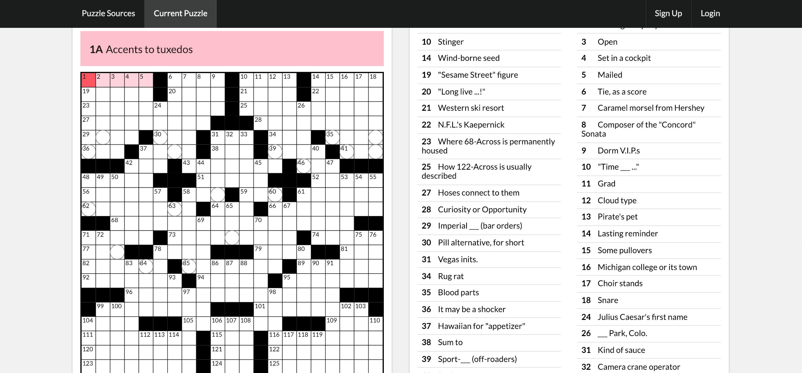

# react-ipuz

This is a demo for **react-ipuz**, a collaborative crossword puzzle player. The frontend was built with React/Redux and the backend is a Ruby on Rails API with Action Cable support to allow real-time collaboration.

Requires [react-ipuz](https://github.com/ihollander/react-ipuz) frontend and [react-ipuz-api](https://github.com/ihollander/react-ipuz-api) backend.

## Features
1. [Convert .puz files to playable crosswords](#file-conversion)
2. [Interactive puzzle grid](#interactive-puzzle-grid)
3. [Puzzle tools and timer](#puzzle-tools)
4. [Save puzzle progress](#saved-puzzles)
5. [Real-time collaboration](#real-time-collaboration)

###File Conversion
Puzzle conversion is made possible thanks to a custom Javascript .puz file parser, written for this project based off this [spec] (https://code.google.com/archive/p/puz/wikis/FileFormat.wiki). Users can upload puzzle files from a number of major crossword puzzle publishers, including the New York Times and Wall Street Journal. Puzzles are parsed client-side into a JSON object which is used to generate the puzzle grid.

The parser also allows for advanced puzzle features such as rebuses (multiple letters in a square), as well as circled grid squares.

###Interactive Puzzle Grid
The puzzle grid is generated as a SVG object to allow for responsive scaling and clean presentation. Users can interact with the grid via mouse and keyboard, as well as navigate to any answer square by clicking the associated clue.

###Puzzle Tools
Puzzle tools allow the user to check their guesses or reveal the answer. The user can also enter rebus answers by toggling the reubs feature. They can also pause the timer, which will hide the puzzle to prevent cheating.

###Saved Puzzles
After logging in, users puzzle progress is automatically saved to the server. They can resume any of their previously saved puzzles from the Saved Puzzles menu (only visible to authenticated users).

###Real-Time Collaboration
Users can collaborate with each other in real time. After sharing a puzzle link with another user, both users will have access to the same puzzle grid and will be able to see the other's answers and cursor position as they work through the puzzle together.

## Resources
* Documentation on the [ipuz](http://www.ipuz.org/) puzzle format 
* Reference to .puz file format spec: [docs](https://code.google.com/archive/p/puz/wikis/FileFormat.wiki)
